# Python Prompt Manager

> **Codyssey B2-1 · Python & Git 기초**  
> Python의 기본 문법과 Git 버전 관리를 학습하며, 흩어진 AI 프롬프트를 추가·분류·검색·즐겨찾기하고 JSON과 Markdown으로 관리할 수 있는 콘솔 기반 프롬프트 관리 프로그램을 구현했습니다.

<p align="center">
  
  
  
  
</p>

---

## Summary

| 구분 | 내용 |
|---|---|
| 해결한 문제 | 여러 작업에 사용한 AI 프롬프트가 대화창·메모 등에 흩어져 다시 찾고 재사용하기 어려운 문제 |
| 구현 형태 | Python 콘솔 기반 Prompt Manager |
| 핵심 기능 | 추가, 목록, 카테고리 조회, 검색, 상세보기, 즐겨찾기 |
| 보너스 1 | JSON 저장·불러오기, 카테고리별 Markdown 내보내기 |
| 보너스 2 | 프롬프트 수정·삭제, 조회수 기록, 조회수 TOP 정렬 |
| 데이터 구조 | Python `list` + `dict`, JSON |
| 버전 관리 | Git 기능 단위 커밋, 별도 브랜치 작업 및 병합 |
| 저장소 | [GitHub Repository](https://github.com/qjskffj-code/codyssey_B2-1) |

### 바로가기

- [주요 기능](#features)
- [CLI 실행 예시](#cli-demo)
- [실행 화면](#screenshots)
- [데이터 저장](#data-persistence)
- [markdown-내보내기](#markdown-export)
- [git-workflow](#git-workflow)
- [테스트](#testing)
- [공식 미션 요구사항 체크리스트](#공식-미션-요구사항-체크리스트)

---

# Overview

이 프로젝트는 Python 문법을 단순히 암기하는 것이 아니라, **실제 사용할 수 있는 작은 프로그램 안에서 변수, 리스트, 딕셔너리, 조건문, 반복문, 함수가 어떻게 연결되는지 익히는 것**을 목표로 했습니다.

그동안 AI 이미지·영상 제작과 자동화 미션에서 작성한 프롬프트를 기본 데이터로 등록하고, 필요한 프롬프트를 검색하거나 카테고리로 조회하고 즐겨찾기할 수 있는 CLI 프로그램을 구현했습니다.

동시에 기능을 하나씩 완성할 때마다 Git으로 변경 이력을 기록하고, 프롬프트 목록 기능은 별도 브랜치에서 작업한 뒤 `main`에 병합하여 기본적인 Git 협업 흐름도 직접 수행했습니다.

## What I Built

1. **Prompt Management**
   - 프롬프트 추가
   - 전체 목록
   - 카테고리별 조회
   - 제목·내용 키워드 검색
   - 상세보기

2. **Favorite & Usage**
   - 즐겨찾기 추가·해제
   - 즐겨찾기 목록
   - 상세보기 조회수 기록
   - 조회수 TOP 정렬

3. **CRUD**
   - 프롬프트 생성
   - 조회
   - 수정
   - 삭제

4. **Persistence & Export**
   - JSON 파일 저장·불러오기
   - 카테고리별 Markdown 내보내기

5. **Git Workflow**
   - 기능 단위 커밋
   - Feature Branch
   - Checkout
   - Merge
   - Push / Pull
   - Clone

## Tech / Tools

| 영역 | 사용 기술 |
|---|---|
| Language | Python 3.10+ |
| Data Structure | List, Dictionary |
| Persistence | JSON |
| Export | Markdown |
| Version Control | Git |
| Remote Repository | GitHub |
| Editor | Visual Studio Code |
| Interface | CLI / Terminal |

---

# Problem

GenAI 미션을 진행하면서 이미지 생성, 영상 생성, 자동화 등 서로 다른 목적으로 작성한 프롬프트가 계속 늘어났습니다.

프롬프트가 여러 대화와 문서에 흩어지면 다음과 같은 문제가 생깁니다.

- 이전에 사용했던 프롬프트를 다시 찾기 어렵다.
- 어떤 목적으로 만든 프롬프트인지 한눈에 구분하기 어렵다.
- 자주 사용하는 프롬프트를 별도로 관리하기 어렵다.
- 같은 프롬프트를 여러 번 복사하거나 다시 작성하게 된다.

이를 해결하기 위해 프롬프트를 하나의 데이터 구조에서 관리하고, **등록 → 조회 → 검색 → 재사용**할 수 있는 개인용 Prompt Manager를 만들었습니다.

---

# Data Model

프로그램의 기본 데이터는 Python의 **리스트 안에 여러 딕셔너리를 저장하는 방식**으로 구성했습니다.

```python
prompts = [
    {
        "title": "AI 로봇 캐릭터 시트 생성",
        "content": "프롬프트 내용...",
        "category": "이미지 생성",
        "favorite": False,
        "views": 0
    }
]
```

| Field | 역할 |
|---|---|
| `title` | 프롬프트 제목 |
| `content` | 프롬프트 전체 내용 |
| `category` | 프롬프트 분류 |
| `favorite` | 즐겨찾기 여부 |
| `views` | 상세보기 조회수 |

## 기본 카테고리

- 텍스트 생성
- 이미지 생성
- 영상 생성
- 페르소나
- 자동화
- 기타

## Initial Prompt Data

이전 Codyssey 미션에서 실제 활용한 프롬프트를 기본 데이터로 등록했습니다.

| 카테고리 | 프롬프트 |
|---|---|
| 이미지 생성 | AI 로봇 캐릭터 시트 생성 |
| 영상 생성 | AI 로봇 립싱크 영상 생성 |
| 자동화 | 노코드 자동화 설계 AI 코치 |

---

# Features

## 1. 프롬프트 추가

제목, 내용, 카테고리를 입력해 새로운 프롬프트를 등록합니다.

- 제목·내용의 빈 값 입력 방지
- 미리 정의된 카테고리 선택
- 입력 중 `0`을 이용한 취소
- 신규 프롬프트의 즐겨찾기 기본값 `False`
- 조회수 기본값 `0`

```text
=== 프롬프트 추가 ===
제목 (0: 취소): 회의록 정리 도우미
내용 (0: 취소): 회의 내용을 핵심 논의사항과 후속 할 일로 정리해줘.

카테고리 선택:
1) 텍스트 생성
2) 이미지 생성
3) 영상 생성
4) 페르소나
5) 자동화
6) 기타
0) 취소

선택: 1

'회의록 정리 도우미' 프롬프트가 추가되었습니다!
```

---

## 2. 프롬프트 목록

저장된 프롬프트의 번호, 카테고리, 제목, 즐겨찾기 여부를 확인할 수 있습니다.

```text
=== 프롬프트 목록 ===
1. [이미지 생성] AI 로봇 캐릭터 시트 생성
2. [영상 생성] AI 로봇 립싱크 영상 생성
3. [자동화] 노코드 자동화 설계 AI 코치

총 3개의 프롬프트
```

---

## 3. 카테고리별 조회

카테고리를 선택하면 해당 카테고리에 속한 프롬프트만 필터링해 보여줍니다.

```text
=== 카테고리별 조회 ===
1) 텍스트 생성
2) 이미지 생성
3) 영상 생성
4) 페르소나
5) 자동화
6) 기타
0) 취소

선택: 2

=== [이미지 생성] 카테고리 프롬프트 ===
1. AI 로봇 캐릭터 시트 생성

총 1개의 프롬프트
```

해당 카테고리에 데이터가 없을 경우 별도 안내 메시지를 출력합니다.

```text
=== [페르소나] 카테고리 프롬프트 ===
해당 카테고리에 등록된 프롬프트가 없습니다.
```

---

## 4. 프롬프트 검색

입력한 키워드가 프롬프트의 **제목 또는 내용**에 포함되어 있는지 확인합니다.

영문 검색에서는 `lower()`를 사용해 대소문자 차이를 줄였습니다.

```text
=== 프롬프트 검색 ===
검색어 (0: 취소): 로봇

검색 결과:
1. [이미지 생성] AI 로봇 캐릭터 시트 생성
2. [영상 생성] AI 로봇 립싱크 영상 생성

2개의 프롬프트를 찾았습니다.
```

검색 결과가 없을 경우:

```text
검색 결과:
검색 결과가 없습니다.
```

---

## 5. 상세보기와 조회수

프롬프트 번호를 선택하면 제목, 카테고리, 즐겨찾기 여부, 조회수, 전체 프롬프트 내용을 확인할 수 있습니다.

상세보기를 실행할 때마다 해당 프롬프트의 `views` 값이 1씩 증가합니다.

```text
────────────────────────────
제목: AI 로봇 캐릭터 시트 생성
카테고리: 이미지 생성
즐겨찾기: 없음
조회수: 2
────────────────────────────
내용:
Character sheet for the attached 3D robot character.
...
────────────────────────────
```

---

## 6. 즐겨찾기

프롬프트 번호를 선택해 즐겨찾기 상태를 추가하거나 해제합니다.

```text
'AI 로봇 캐릭터 시트 생성' 프롬프트를 즐겨찾기에 추가했습니다!
```

즐겨찾기 목록에서는 선택된 프롬프트만 별도로 확인할 수 있습니다.

```text
=== 즐겨찾기 목록 ===
1. [이미지 생성] AI 로봇 캐릭터 시트 생성 ⭐

총 1개의 즐겨찾기
```

---

## 7. 프롬프트 수정

기존 프롬프트의 제목, 내용, 카테고리를 변경할 수 있습니다.

변경하지 않을 값은 Enter를 눌러 기존 값을 유지합니다.

```text
현재 정보
제목: AI 로봇 캐릭터 시트 생성
카테고리: 이미지 생성

새 값을 입력하세요.
변경하지 않으려면 그냥 Enter를 누르세요.

새 제목: AI 로봇 캐릭터 시트 생성 테스트
새 내용:
```

---

## 8. 프롬프트 삭제

삭제할 프롬프트를 선택한 뒤 `y / n` 확인 절차를 거쳐 삭제합니다.

```text
삭제할 프롬프트: 노코드 자동화 설계 AI 코치
정말 삭제하시겠습니까? (y/n): y

'노코드 자동화 설계 AI 코치' 프롬프트를 삭제했습니다.
```

---

## 9. 조회수 TOP

프롬프트의 `views` 값을 기준으로 높은 순서대로 정렬합니다.

```text
=== 조회수 TOP ===
1. AI 로봇 캐릭터 시트 생성 - 조회수 3회
2. AI 로봇 립싱크 영상 생성 - 조회수 1회
3. 노코드 자동화 설계 AI 코치 - 조회수 0회
```

---

# CLI Demo

전체 기능은 하나의 메인 메뉴에서 선택할 수 있습니다.

```text
=== 나만의 프롬프트 관리 ===
1. 프롬프트 추가
2. 프롬프트 목록
3. 카테고리별 조회
4. 프롬프트 검색
5. 프롬프트 상세 보기
6. 즐겨찾기 관리
7. 즐겨찾기 목록
8. 프롬프트 수정
9. 프롬프트 삭제
10. 조회수 TOP
11. Markdown 내보내기
0. 종료
```

각 기능 수행 후 다시 메인 메뉴로 돌아가며, `0`을 입력하면 프로그램을 종료합니다.

잘못된 메뉴 번호를 입력하면 프로그램을 종료하지 않고 다시 입력할 수 있도록 처리했습니다.

---

# Screenshots

실행 화면 이미지는 모두 [`assets/images/`](assets/images/)에 저장합니다.

## 초기 구성 및 실행 확인

### Hello 실행

<p align="center">
  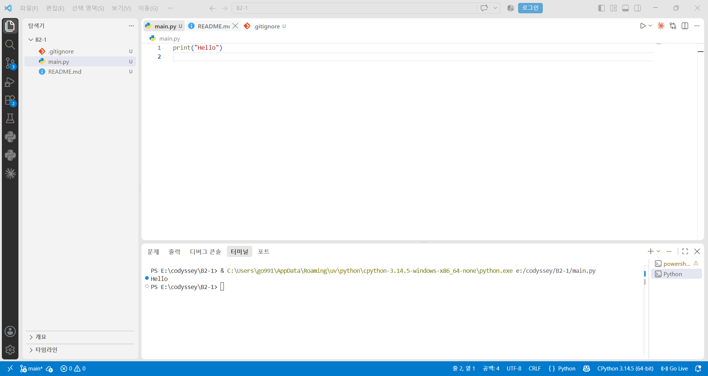
</p>

### 프로젝트 기본 파일 작성

<p align="center">
  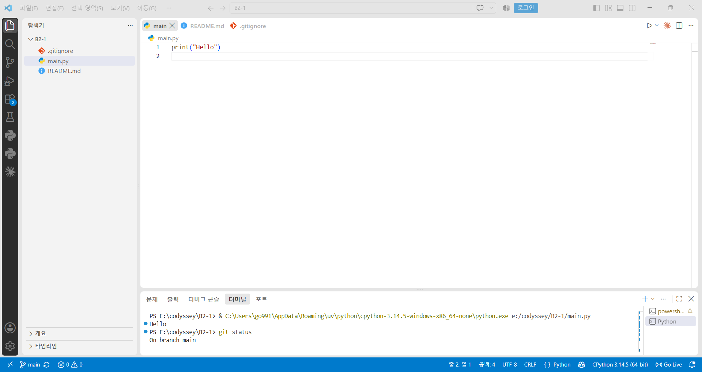
</p>

<p align="center">
  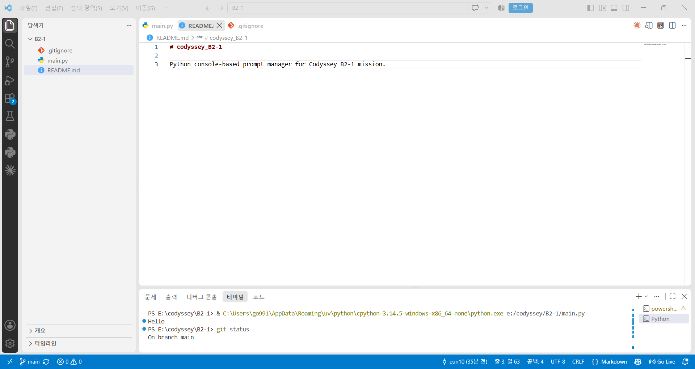
</p>

<p align="center">
  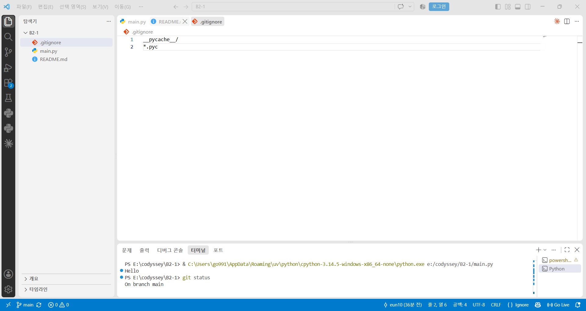
</p>

## 기능별 실행 화면

### 01. 프롬프트 추가

<p align="center">
  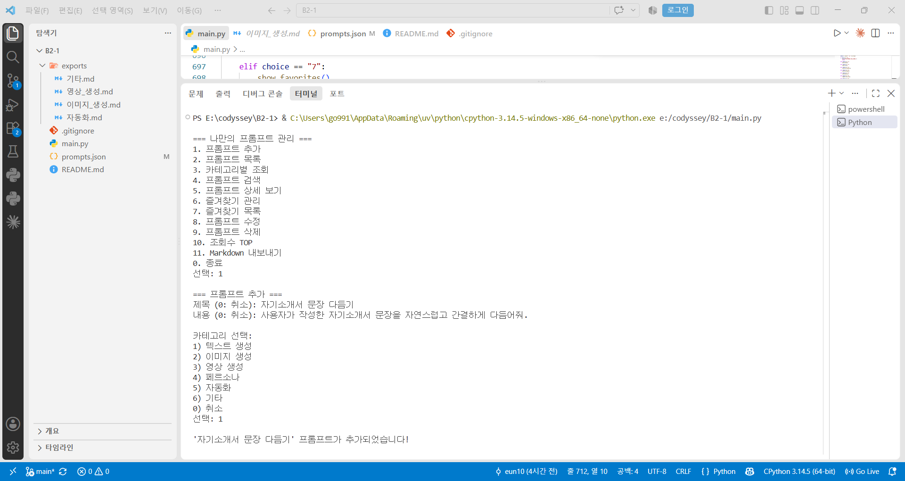
</p>

<p align="center">
  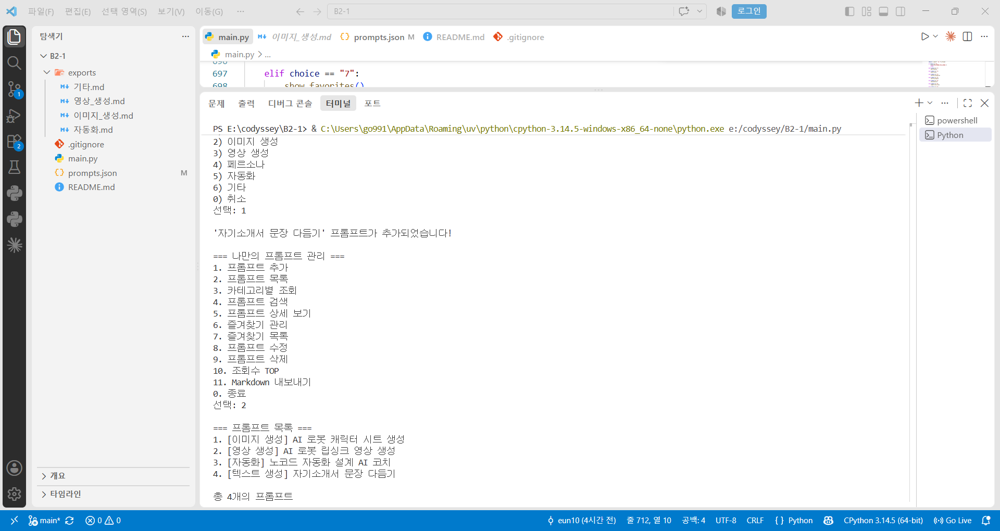
</p>

### 03. 카테고리별 조회

<p align="center">
  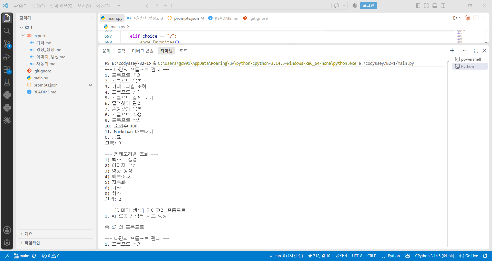
</p>

### 04. 프롬프트 검색

<p align="center">
  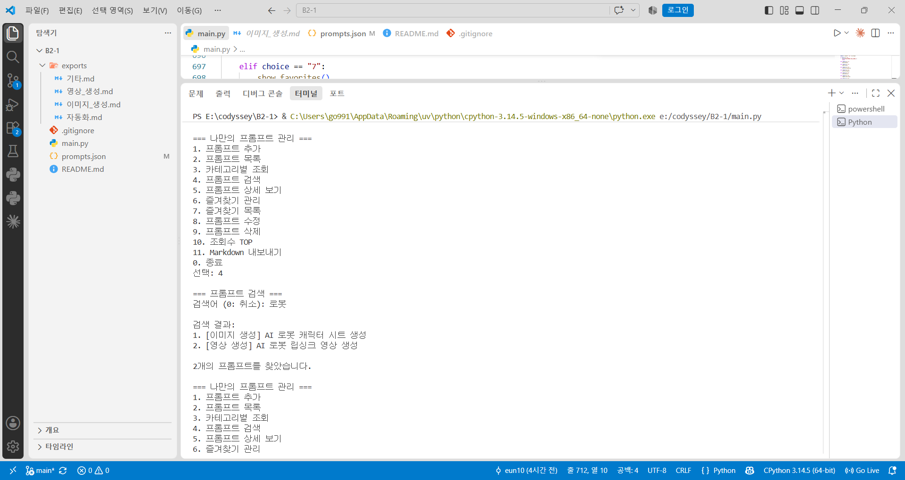
</p>

### 05. 상세보기

<p align="center">
  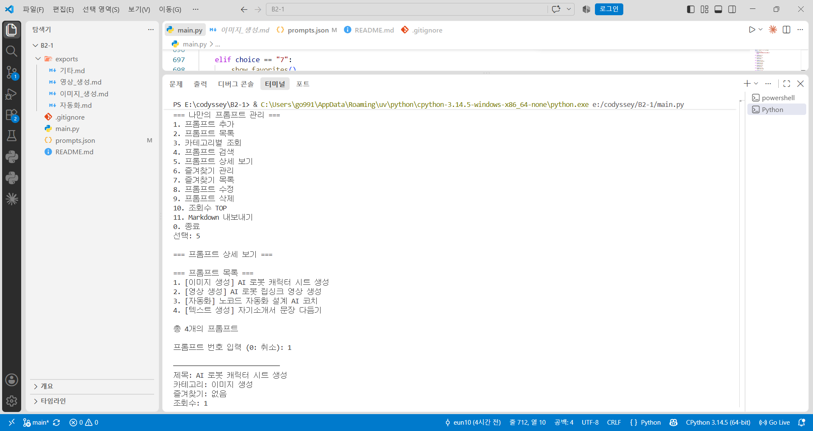
</p>

<p align="center">
  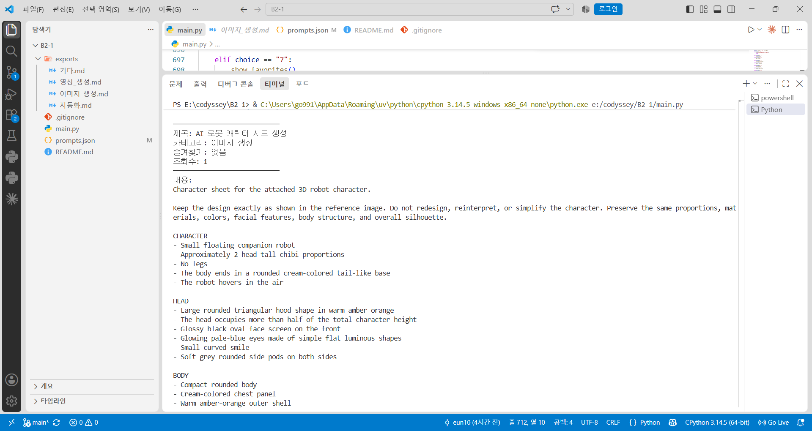
</p>

### 06–07. 즐겨찾기 관리 및 목록

<p align="center">
  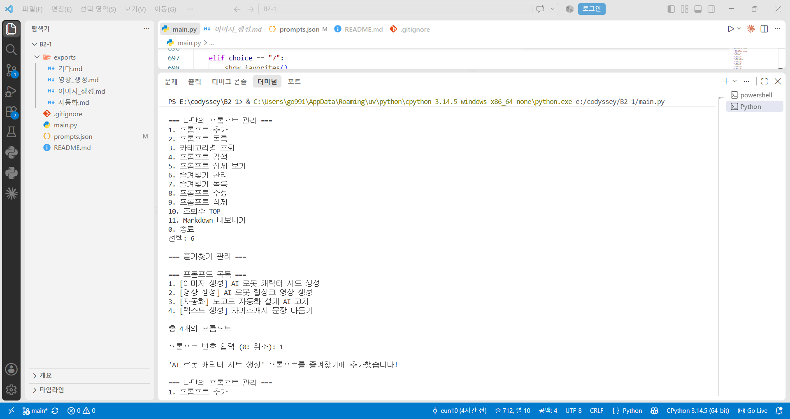
</p>

<p align="center">
  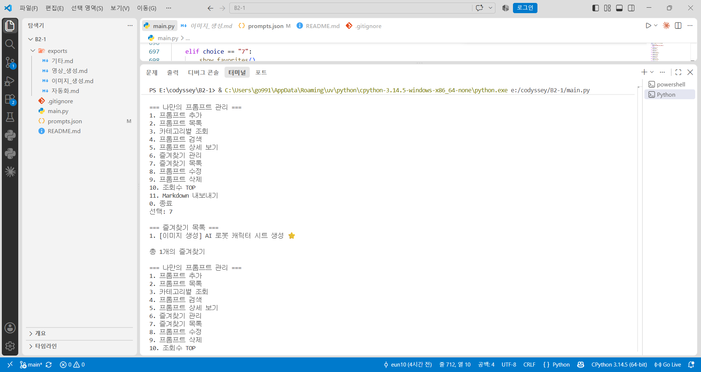
</p>

### 08. 프롬프트 수정

<p align="center">
  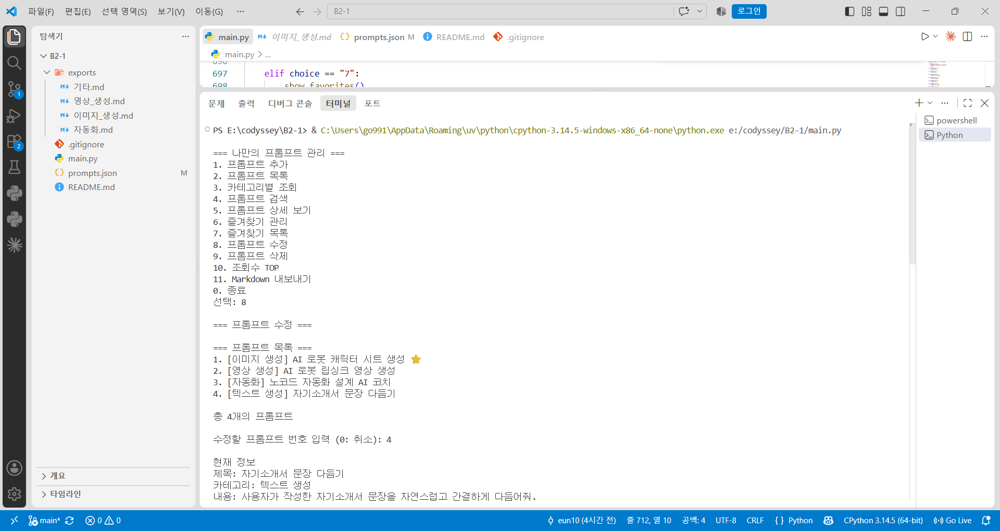
</p>

<p align="center">
  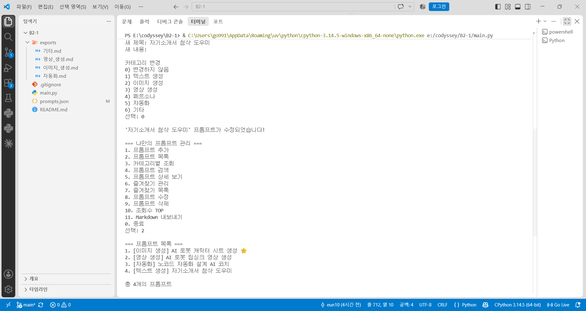
</p>

### 09. 프롬프트 삭제

<p align="center">
  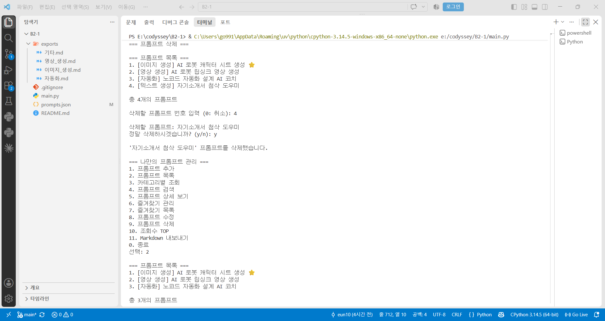
</p>

### 10. 조회수 TOP

<p align="center">
  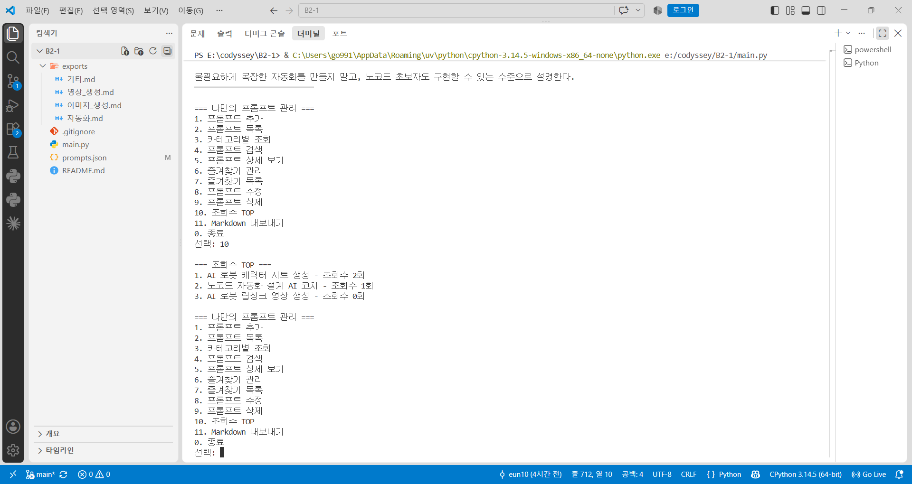
</p>

### 11. Markdown 내보내기

<p align="center">
  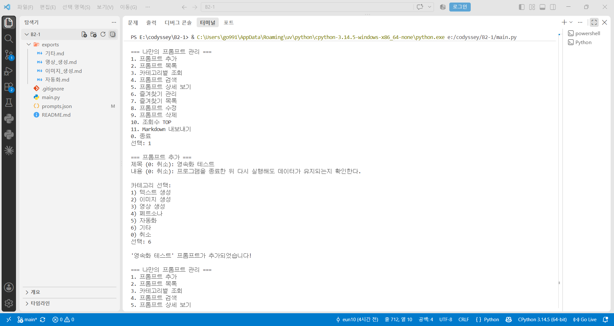
</p>

<p align="center">
  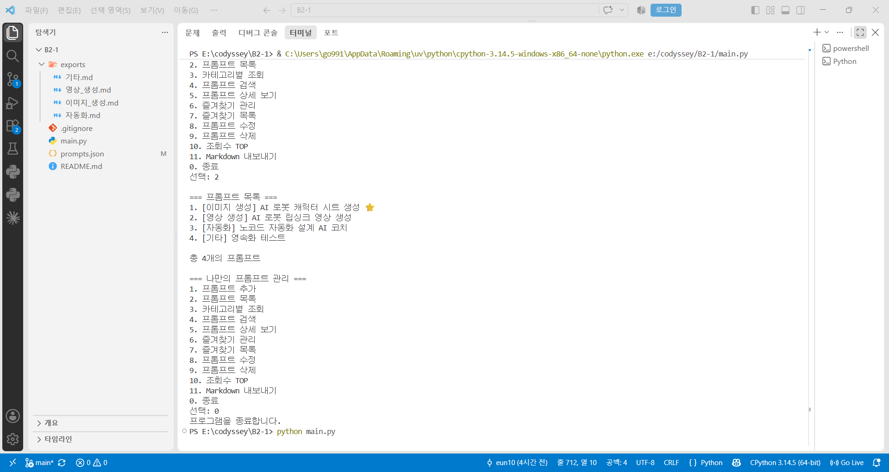
</p>

<p align="center">
  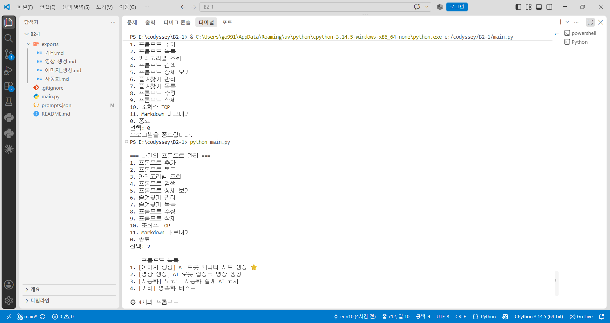
</p>

---

# Data Persistence

필수 요구사항에서는 프로그램 실행 중 데이터 유지까지만 필요하지만, 보너스 과제로 JSON 기반 영속화를 추가했습니다.

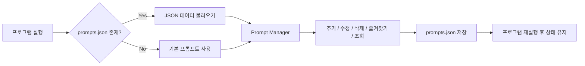
```mermaid
flowchart LR
    A["프로그램 실행"] --> B{"prompts.json 존재?"}
    B -- "Yes" --> C["JSON 데이터 불러오기"]
    B -- "No" --> D["기본 프롬프트 사용"]
    C --> E["Prompt Manager"]
    D --> E
    E --> F["추가 / 수정 / 삭제 / 즐겨찾기 / 조회"]
    F --> G["prompts.json 저장"]
    G --> H["프로그램 재실행 후 상태 유지"]
```

프로그램이 실행될 때 `prompts.json`이 있으면 기존 데이터를 불러오고, 파일이 없다면 기본 프롬프트 데이터를 사용합니다.

데이터 변경이 발생하면 JSON 파일에 다시 저장합니다.

```json
[
    {
        "title": "AI 로봇 캐릭터 시트 생성",
        "content": "프롬프트 내용...",
        "category": "이미지 생성",
        "favorite": false,
        "views": 2
    }
]
```

이를 통해 프로그램을 종료했다 다시 실행해도 다음 상태가 유지됩니다.

- 추가한 프롬프트
- 수정한 내용
- 삭제 결과
- 즐겨찾기 상태
- 조회수

---

# Markdown Export

프롬프트 데이터를 카테고리별 Markdown 파일로 내보낼 수 있습니다.

```text
exports/
├─ 기타.md
├─ 영상_생성.md
├─ 이미지_생성.md
└─ 자동화.md
```

프롬프트가 존재하지 않는 카테고리는 별도 파일을 만들지 않습니다.

Markdown 파일은 다음과 같은 구조로 생성됩니다.

```markdown
# 이미지 생성 프롬프트

## AI 로봇 캐릭터 시트 생성

- 즐겨찾기: 없음
- 조회수: 2회

### 프롬프트

Character sheet for the attached 3D robot character.
...
```

이 기능을 통해 프로그램 내부 데이터를 사람이 읽기 쉬운 문서 형식으로 변환할 수 있도록 했습니다.

---

# Git Workflow

이번 프로젝트에서는 완성된 코드를 한 번에 업로드하지 않고, 기능 단위로 변경 이력을 관리했습니다.

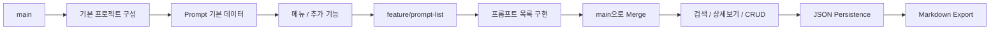
```mermaid
flowchart LR
    A["main"] --> B["기본 프로젝트 구성"]
    B --> C["Prompt 기본 데이터"]
    C --> D["메뉴 / 추가 기능"]
    D --> E["feature/prompt-list"]
    E --> F["프롬프트 목록 구현"]
    F --> G["main으로 Merge"]
    G --> H["검색 / 상세보기 / CRUD"]
    H --> I["JSON Persistence"]
    I --> J["Markdown Export"]
```

## Branch Workflow

`프롬프트 목록` 기능은 별도 브랜치에서 작업했습니다.

```text
main
  │
  ├── feature/prompt-list
  │        └── feat: implement prompt list
  │
  └── merge: prompt list feature
```

사용한 주요 Git 명령:

```bash
git init
git add
git commit
git push
git pull
git clone
git checkout
git merge
```

### Git Log

> `git log --oneline --graph --all --decorate` 실행 결과

<p align="center">
  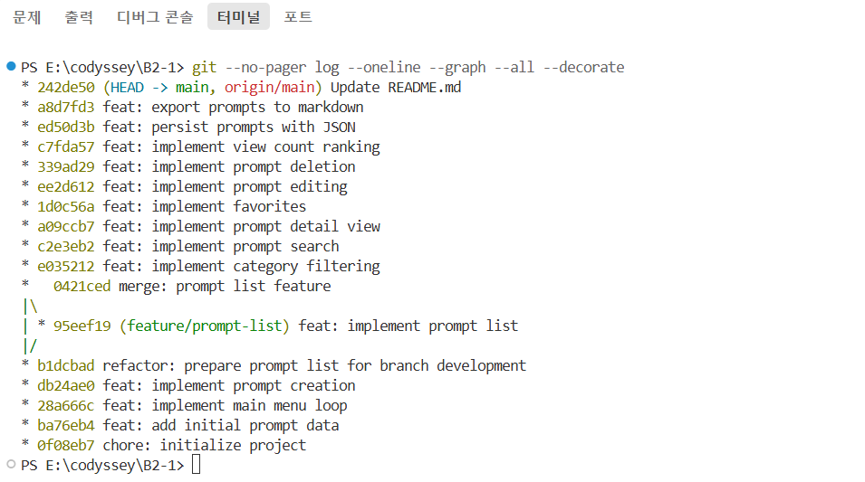
</p>

### Git 실행 증빙

<p align="center">
  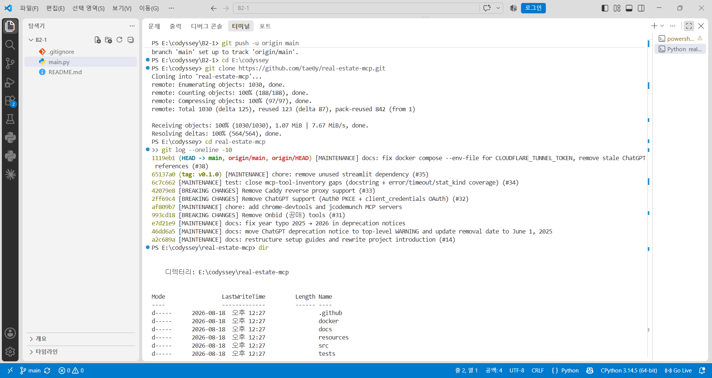
</p>

<p align="center">
  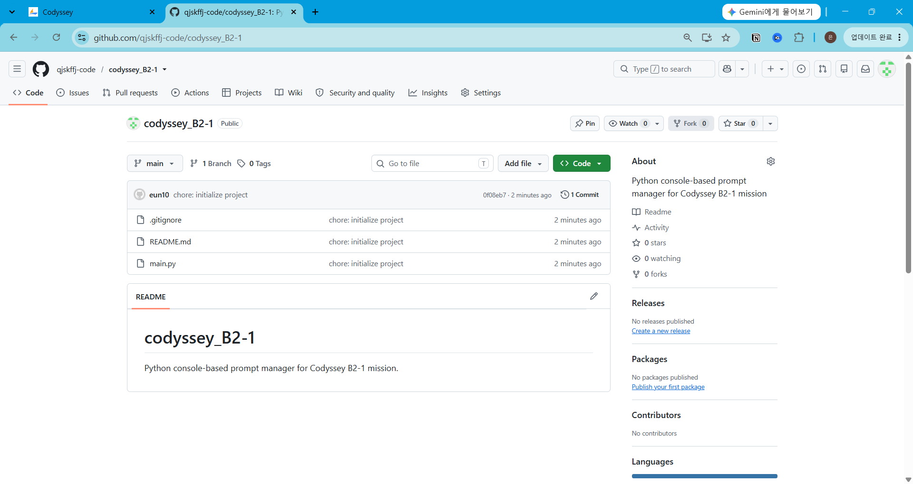
</p>

<p align="center">
  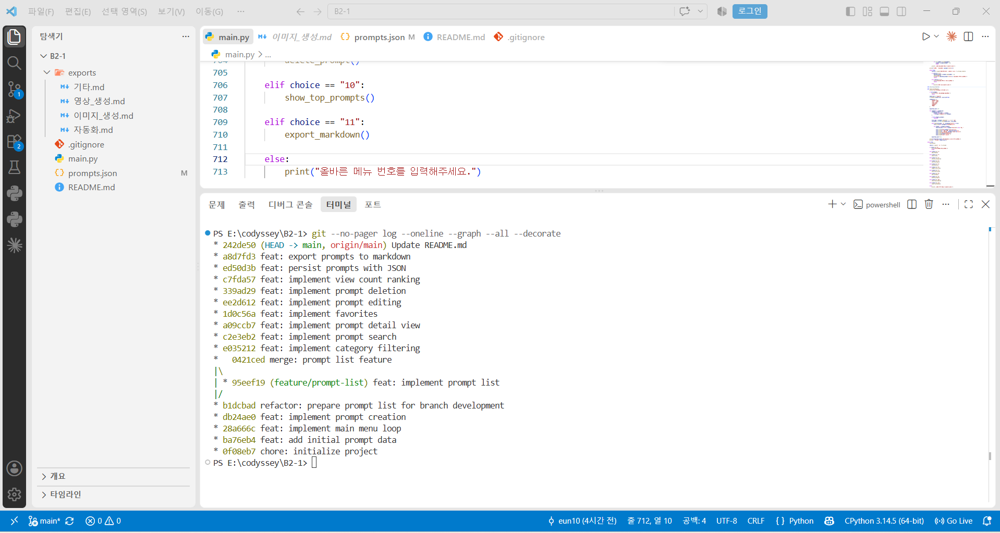
</p>

---

# Project Structure

```text
B2-1/
├─ main.py
├─ prompts.json
├─ README.md
├─ .gitignore
├─ exports/
│  ├─ 기타.md
│  ├─ 영상_생성.md
│  ├─ 이미지_생성.md
│  └─ 자동화.md
└─ assets/
   └─ images/
      ├─ 코디세이_B2-1_실행화면_Hello출력.png
      ├─ 코디세이_B2-1_실행화면_mainpy작성및Hello출력.png
      ├─ 코디세이_B2-1_실행화면_README작성.png
      ├─ 코디세이_B2-1_실행화면_gitignore설정.png
      ├─ 코디세이_B2-1_실행화면_01_프롬프트추가_1.png
      ├─ 코디세이_B2-1_실행화면_01_프롬프트추가_2.png
      ├─ 코디세이_B2-1_실행화면_03_카테고리조회.png
      ├─ 코디세이_B2-1_실행화면_04_프롬프트검색.png
      ├─ 코디세이_B2-1_실행화면_05_상세보기_1.png
      ├─ 코디세이_B2-1_실행화면_05_상세보기_2.png
      ├─ 코디세이_B2-1_실행화면_06_즐겨찾기관리.png
      ├─ 코디세이_B2-1_실행화면_07_즐겨찾기목록.png
      ├─ 코디세이_B2-1_실행화면_08_프롬프트수정_1.png
      ├─ 코디세이_B2-1_실행화면_08_프롬프트수정_2.png
      ├─ 코디세이_B2-1_실행화면_09_프롬프트삭제.png
      ├─ 코디세이_B2-1_실행화면_10_조회수TOP.png
      ├─ 코디세이_B2-1_실행화면_11_Markdown내보내기_1.png
      ├─ 코디세이_B2-1_실행화면_11_Markdown내보내기_2.png
      ├─ 코디세이_B2-1_실행화면_11_Markdown내보내기_3.png
      ├─ 코디세이_B2-1_실행화면_gitclone및gitlog.png
      ├─ 코디세이_B2-1_실행화면_gitcommit_GitHub확인.png
      ├─ 코디세이_B2-1_실행화면_gitlog_전체화면.png
      └─ 코디세이_B2-1_실행화면_gitlog_클로즈업.png
```

> 모든 실행 화면은 `assets/images`에서 통합 관리하며, README의 이미지 경로와 실제 파일명을 동일하게 유지합니다.

---

# Testing

필수 기능과 보너스 기능이 각각 정상적으로 동작하는지 기능별로 테스트했습니다.

| ID | 시나리오 | 기대 결과 | 확인 |
|---|---|---|:---:|
| T-01 | 프로그램 실행 | 메인 메뉴 출력 | ✅ |
| T-02 | 잘못된 메뉴 번호 입력 | 오류 안내 후 메뉴 재출력 | ✅ |
| T-03 | 프롬프트 추가 | 새 데이터가 목록에 추가 | ✅ |
| T-04 | 제목 또는 내용 빈 값 입력 | 재입력 요청 | ✅ |
| T-05 | 프롬프트 목록 | 전체 프롬프트 출력 | ✅ |
| T-06 | 이미지 생성 카테고리 선택 | 해당 카테고리 데이터만 출력 | ✅ |
| T-07 | 데이터 없는 카테고리 선택 | 데이터 없음 안내 | ✅ |
| T-08 | `로봇` 검색 | 제목·내용이 일치하는 프롬프트 출력 | ✅ |
| T-09 | 존재하지 않는 검색어 입력 | 검색 결과 없음 안내 | ✅ |
| T-10 | 상세보기 반복 실행 | 조회수 증가 | ✅ |
| T-11 | 즐겨찾기 추가 | ⭐ 상태 반영 | ✅ |
| T-12 | 즐겨찾기 해제 | 즐겨찾기 목록에서 제거 | ✅ |
| T-13 | 프롬프트 제목 수정 | 변경된 제목이 목록에 반영 | ✅ |
| T-14 | 삭제 후 목록 확인 | 선택한 프롬프트 제거 | ✅ |
| T-15 | 상세보기 횟수 차등 생성 | 조회수 기준 내림차순 정렬 | ✅ |
| T-16 | 프로그램 종료 후 재실행 | JSON 데이터 유지 | ✅ |
| T-17 | Markdown 내보내기 | 카테고리별 `.md` 파일 생성 | ✅ |

---

# 공식 미션 요구사항 체크리스트

## 개발 환경

| 요구사항 | 구현 / 확인 내용 | 상태 |
|---|---|:---:|
| VSCode 사용 | 프로젝트 작성·실행 환경 | ✅ |
| Python Extension | VSCode Python 실행 환경 구성 | ✅ |
| Python 3.10 이상 | 버전 확인 완료 | ✅ |
| `print("Hello")` 실행 | 초기 개발환경 테스트 완료 | ✅ |
| Git 버전 확인 | 터미널에서 확인 | ✅ |
| Git 사용자 이름 설정 | `user.name` 확인 | ✅ |
| Git 사용자 이메일 설정 | `user.email` 확인 | ✅ |
| 기본 브랜치 `main` | `init.defaultBranch` 설정 | ✅ |

## Git / GitHub

| 요구사항 | 구현 / 확인 내용 | 상태 |
|---|---|:---:|
| GitHub 저장소 생성 | Public Repository 생성 | ✅ |
| `git init` | 로컬 저장소 초기화 | ✅ |
| `git add` | 기능별 변경사항 staging | ✅ |
| `git commit` | 기능 단위 커밋 | ✅ |
| `git push` | GitHub main에 업로드 | ✅ |
| `git pull` | GitHub README 수정 후 로컬 반영 | ✅ |
| `git clone` | 공개 GitHub 저장소 clone 및 로그 확인 | ✅ |
| `git checkout` | Feature Branch 생성·이동 | ✅ |
| `git merge` | `feature/prompt-list` → `main` 병합 | ✅ |
| 최소 10개 의미 있는 커밋 | 기능 단위 커밋 기록 | ✅ |
| `.gitignore` | Python 불필요 파일 제외 | ✅ |
| README | 프로젝트 설명·실행 방법·기능 정리 | ✅ |

## 프로그램 기능

| 요구사항 | 구현 내용 | 상태 |
|---|---|:---:|
| 메뉴 출력 | 번호 기반 CLI 메뉴 | ✅ |
| 잘못된 번호 처리 | 안내 후 메뉴 복귀 | ✅ |
| 종료 기능 | `0` 입력 시 종료 | ✅ |
| 기본 프롬프트 3개 이상 | 이전 미션 프롬프트 등록 | ✅ |
| List + Dictionary | 데이터 구조로 사용 | ✅ |
| 제목·내용·카테고리·즐겨찾기 | 필수 필드 구성 | ✅ |
| 프롬프트 추가 | 입력값 검증 포함 | ✅ |
| 프롬프트 목록 | 번호·카테고리·즐겨찾기 표시 | ✅ |
| 추가 브랜치 활용 | 프롬프트 목록 기능에서 사용 | ✅ |
| 카테고리별 조회 | 카테고리 필터링 | ✅ |
| 검색 | 제목·내용 키워드 검색 | ✅ |
| 상세 보기 | 전체 내용 출력 | ✅ |
| 즐겨찾기 관리 | 추가·해제 | ✅ |
| 즐겨찾기 목록 | 즐겨찾기만 조회 | ✅ |
| 기능별 함수 분리 | 메뉴·CRUD·검색 등 함수 구성 | ✅ |

## Bonus

| 요구사항 | 구현 내용 | 상태 |
|---|---|:---:|
| JSON 저장 | `prompts.json` 저장 | ✅ |
| JSON 불러오기 | 프로그램 시작 시 복원 | ✅ |
| Markdown 내보내기 | 카테고리별 `.md` 생성 | ✅ |
| 프롬프트 수정 | Update 구현 | ✅ |
| 프롬프트 삭제 | Delete 구현 | ✅ |
| 사용 횟수 | 상세보기 시 `views` 증가 | ✅ |
| 조회수 정렬 | TOP 목록 제공 | ✅ |

---

# How to Run

## 1. 저장소 Clone

```bash
git clone https://github.com/qjskffj-code/codyssey_B2-1.git
```

## 2. 프로젝트 폴더 이동

```bash
cd codyssey_B2-1
```

## 3. 프로그램 실행

```bash
python main.py
```

외부 Python 라이브러리는 사용하지 않으므로 별도의 패키지 설치 과정은 필요하지 않습니다.

---

# Deliverables

| 산출물 | 위치 |
|---|---|
| Python 프로그램 | [`main.py`](main.py) |
| 저장 데이터 | [`prompts.json`](prompts.json) |
| Markdown Export | [`exports/`](exports/) |
| 프로젝트 설명 | [`README.md`](README.md) |
| GitHub 저장소 | [codyssey_B2-1](https://github.com/qjskffj-code/codyssey_B2-1) |
| 실행 화면 및 제출 증빙 | [`assets/images/`](assets/images/) |
| Git Graph | `assets/images/코디세이_B2-1_실행화면_gitlog_클로즈업.png` |

---

# What I Learned

- Python에서 `list`와 `dict`를 조합해 여러 데이터를 구조적으로 관리하는 방법
- `input()`, `if / elif / else`, `for`, `while`을 실제 프로그램 흐름에 연결하는 방법
- 기능을 함수로 분리해 한 코드 안의 역할을 구분하는 방법
- 문자열 검색과 조건식을 이용해 원하는 데이터를 필터링하는 방법
- `sorted()`와 `lambda`를 이용해 데이터를 특정 기준으로 정렬하는 방법
- JSON 파일을 이용해 프로그램 종료 후에도 데이터를 유지하는 방법
- Python 데이터를 Markdown 문서로 변환해 외부에서 활용하는 방법
- Git에서 작업 내용을 기능 단위로 커밋하고 변경 이력을 추적하는 방법
- Feature Branch에서 기능을 개발한 뒤 `main`에 병합하는 기본적인 Git Workflow
- 원격 저장소와 로컬 저장소 사이에서 `push`, `pull`, `clone`이 각각 어떤 역할을 하는지 직접 확인한 경험

---

# Limitations & Future Work

현재 프로그램은 Python과 Git의 기초 개념을 익히기 위한 CLI 프로젝트로 구현했습니다.

향후 실제 개인 지식관리 시스템으로 확장한다면 다음을 고려할 수 있습니다.

- 프롬프트별 태그와 사용 도구 정보 추가
- 생성일·수정일 등 메타데이터 관리
- 키워드뿐 아니라 의미 기반 검색 지원
- 프롬프트 버전 및 수정 이력 관리
- CLI를 웹 또는 GUI 인터페이스로 확장
- Markdown 파일과 양방향 동기화
- AI 모델 API와 연결해 프로그램 안에서 직접 프롬프트 실행
- 프롬프트 단위 관리에서 확장해 별도 **AKM 기반 지식관리 체계**와 연결

> AKM 구조와 AI Agent 기반 지식 검색·실행·학습 기능은 현재 B2-1 구현 범위에 포함하지 않으며, 후속 프로젝트에서 별도로 다룰 예정입니다.

---

## 한 줄 회고

> Python 문법을 따로 외우는 것보다, **작은 기능을 직접 만들고 Git으로 변화 과정을 기록하면서 하나의 프로그램으로 연결해보는 과정이 코드와 버전 관리의 역할을 이해하는 데 가장 도움이 되었습니다.**
